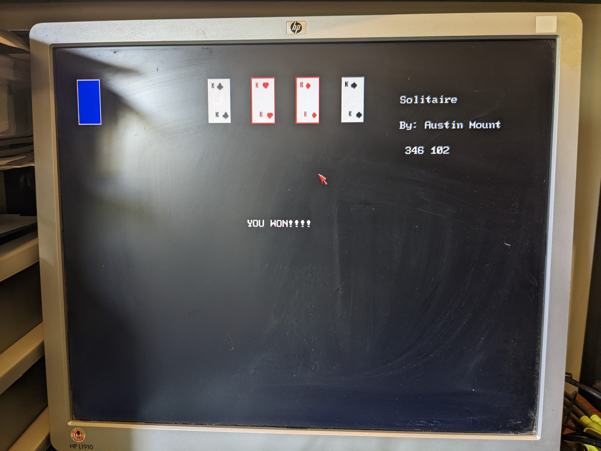
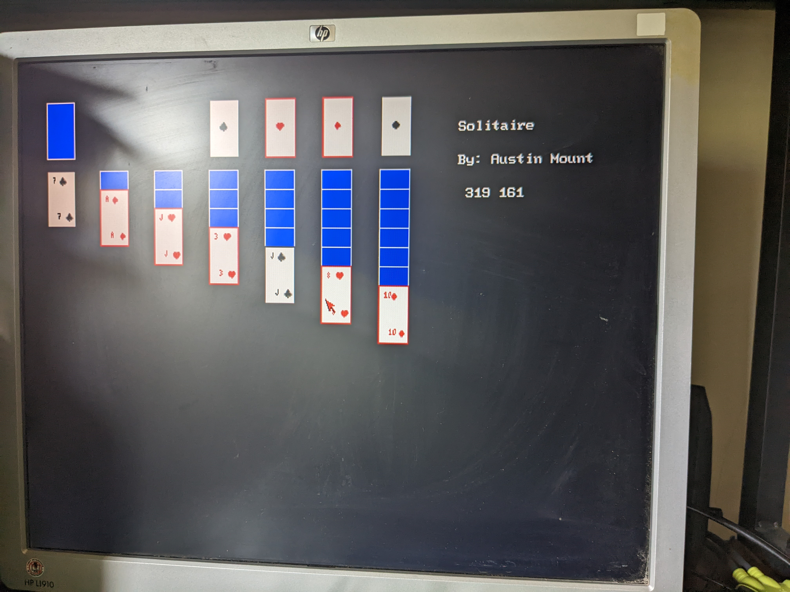
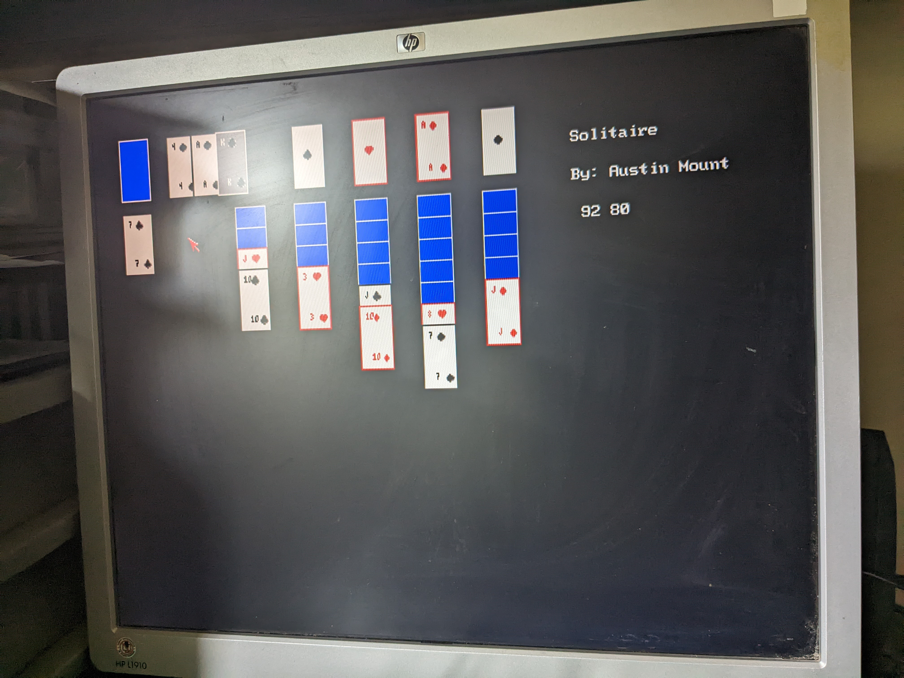

# FabGL Solitaire

## Status

I think I have all the bugs worked out.

## Installation/Flashing ESP32 VGA TTGO

1. Clone these repos:
* https://github.com/fdivitto/FabGL.git
* https://github.com/espressif/arduino-esp32.git
* https://github.com/plerup/makeEspArduino.git
2. Edit Makefile with paths accordingly.
3. <code>make upload</code>

## Usage

* Left mouse click on deck to turn.  
* Left mouse click to select card and destination.
* Right mouse click reboots device.

## Images

